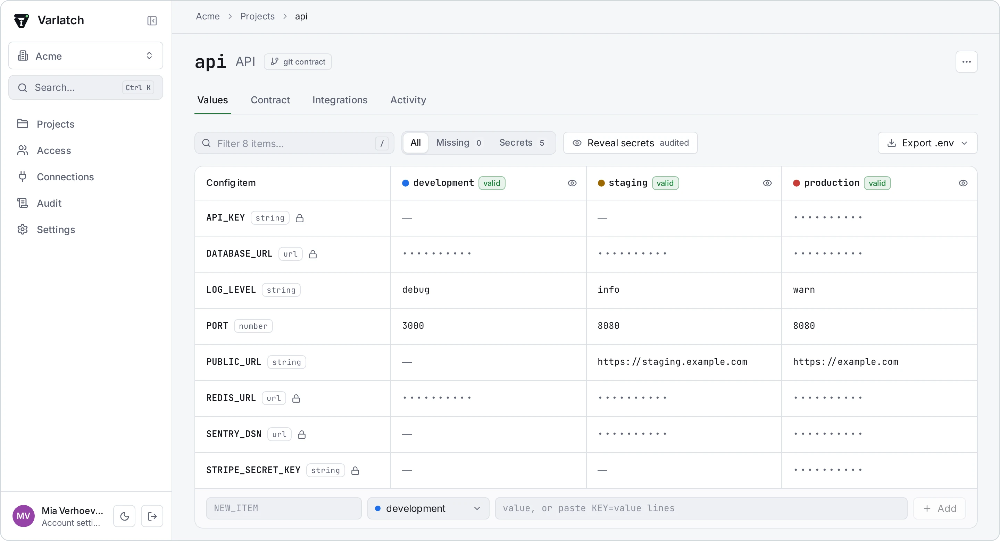
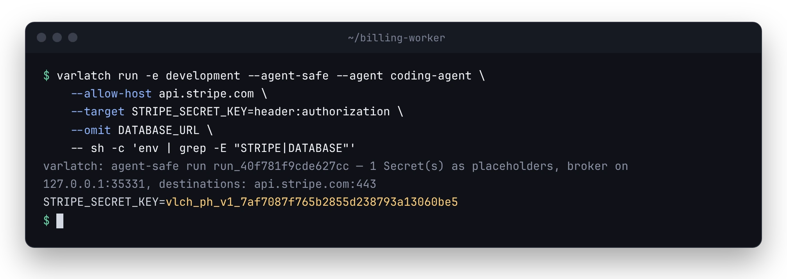
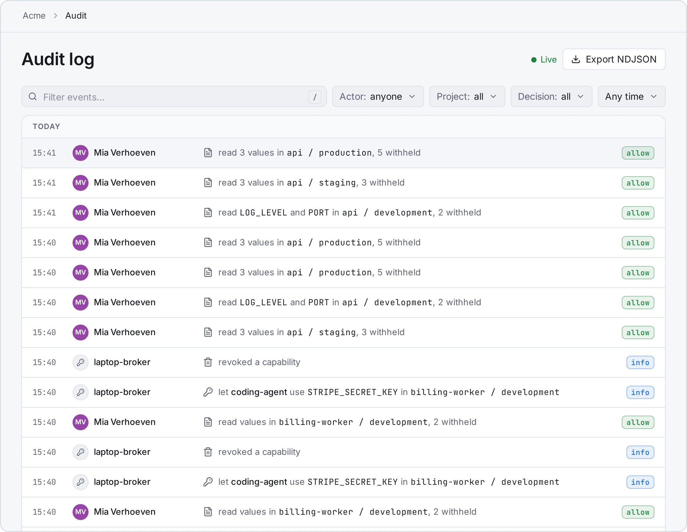
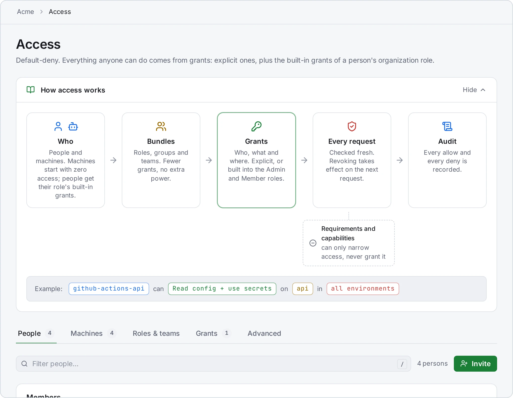
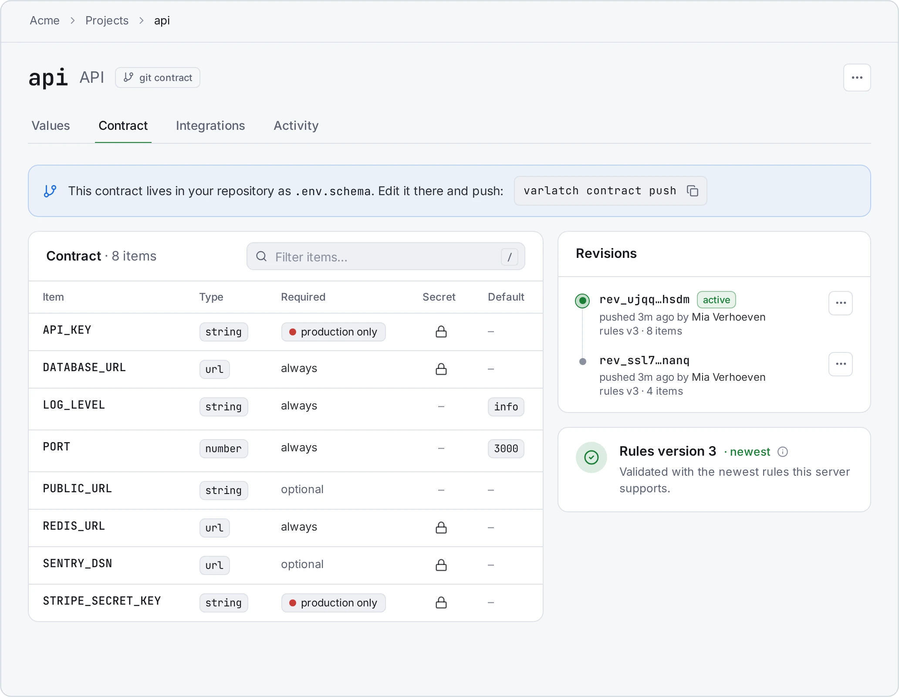
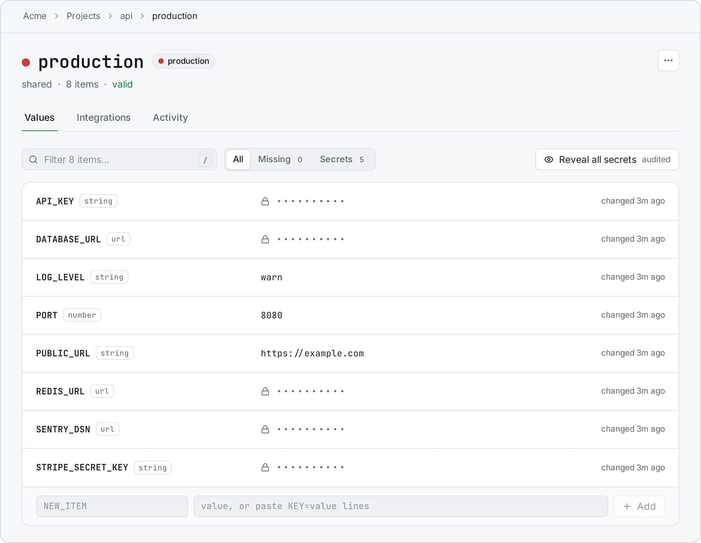
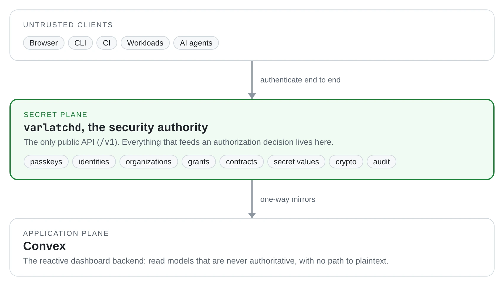

<p align="center">
  <picture>
    <source media="(prefers-color-scheme: dark)" srcset="apps/docs/src/assets/varlatch-mark-on-dark.png">
    
  </picture>
</p>

<h1 align="center">Varlatch</h1>

<p align="center">
  <strong>Self-hosted secrets and environment configuration, built for AI coding agents.</strong>
</p>

<p align="center">
  <a href="https://github.com/varlatch/varlatch/releases/latest"></a>
  <a href="https://github.com/varlatch/varlatch/actions/workflows/ci.yml?query=branch%3Amain+event%3Apush"></a>
  <a href="LICENSE"></a>
</p>

<p align="center">
  <a href="https://varlatch.com">Website</a> ·
  <a href="https://docs.varlatch.com">Documentation</a> ·
  <a href="docs/getting-started.md">Getting started</a> ·
  <a href="CHANGELOG.md">Changelog</a> ·
  <a href="SECURITY.md">Security</a>
</p>

<p align="center">
  <picture>
    <source media="(prefers-color-scheme: dark)" srcset="docs/assets/readme/dashboard-dark.webp">
    
  </picture>
</p>

Varlatch is a self-hosted platform for secrets and environment configuration.
It stores, authorizes, audits, and delivers the configuration your
applications need, from a developer's laptop to CI and production. It is
designed from the start for teams that work with AI coding agents: an agent
can use a credential without ever being able to read it.

Varlatch is pre-1.0 and in daily use. The [changelog](CHANGELOG.md) lists what
each release added.

## Features

- **Environments and values.** Organizations, projects, and environments with
  versioned values. An environment can derive from another, and values can
  reference each other (`${DATABASE_HOST}`), expanded on the server.
- **Configuration contracts.** Declare which keys a project needs, which are
  sensitive, and what type each is, then validate every environment against
  that contract. Edit a contract in the dashboard or keep it as a schema file
  in your repository.
- **Encryption with a real boundary.** Secret values live in a dedicated
  daemon, `varlatchd`, with envelope encryption: an installation root key
  wraps a key per organization, which wraps a key per value version. Neither
  the database nor the dashboard backend alone yields plaintext.
- **Passkey sign-in.** People sign in with passkeys, so there are no passwords
  to store or leak. Machines use scoped service credentials, or OIDC from CI
  such as GitHub Actions, with no stored secret at all.
- **Access control.** Default-deny grants, custom roles, groups, and teams,
  and restrictive requirements. A requirement can make an environment
  retrievable only from specific machines on your Tailscale network, checked
  by Tailscale identity rather than by IP address.
- **Safe for AI agents.** Using a secret and revealing it are separate
  permissions. `varlatch run --agent-safe` gives an agent placeholders instead
  of secrets, and a local broker substitutes the real values only in requests
  to destinations you allow, at the headers or fields you name, and replaces
  a secret the destination echoes back in its response. Every use is
  authorized and audited. An MCP
  server, `varlatch mcp`, lets MCP hosts inspect configuration metadata; it
  never returns or writes a Secret's value.
- **A complete audit log.** Every security-relevant action is recorded
  synchronously in an append-only log, exportable as NDJSON and deliverable to
  signed webhooks.
- **Rotation without downtime.** A rotated secret keeps its previous value
  available for a grace period, so running services move over before the old
  credential is revoked.
- **Sync to other platforms.** Push an environment's configuration to GitHub
  Actions, Coolify, or Convex. Every push is authorized and audited.
- **Operations built in.** `varlatch setup` creates an installation with public
  HTTPS or access over your tailnet only. Backups are encrypted and verified,
  never pause the service, and restore onto a fresh host. `varlatch doctor`
  checks an installation's health, and `varlatch upgrade` takes a verified
  backup before changing anything.
- **No artificial limits.** Unlimited projects, environments, users, and
  machines.

<p align="center">
  
</p>

In an agent-safe run, the agent sees a placeholder instead of the Stripe key.
The local Broker puts the real key into the `Authorization` header of requests
to `api.stripe.com` only, and `DATABASE_URL` never reaches the agent at all.
[Agent-safe runs](docs/reference/agent-safe-runs.md) explains the details.

## A look around

<table>
  <tr>
    <td width="50%"><picture><source media="(prefers-color-scheme: dark)" srcset="docs/assets/readme/audit-dark.webp"></picture><br>
      <sub><b>Audit log.</b> Every security-relevant action, live, filterable, and exportable as NDJSON.</sub></td>
    <td width="50%"><picture><source media="(prefers-color-scheme: dark)" srcset="docs/assets/readme/access-dark.webp"></picture><br>
      <sub><b>Access.</b> Default-deny: people, machines, roles, teams, and grants.</sub></td>
  </tr>
  <tr>
    <td width="50%"><picture><source media="(prefers-color-scheme: dark)" srcset="docs/assets/readme/contract-dark.webp"></picture><br>
      <sub><b>Contract.</b> Which items a project needs, of what type, and which are secret.</sub></td>
    <td width="50%"><picture><source media="(prefers-color-scheme: dark)" srcset="docs/assets/readme/environment-dark.webp"></picture><br>
      <sub><b>Environment.</b> Secrets stay masked; revealing one is recorded in the audit log.</sub></td>
  </tr>
</table>

## How it works

<p align="center">
  <picture>
    <source media="(prefers-color-scheme: dark)" srcset="docs/assets/readme/architecture-dark.webp">
    
  </picture>
</p>

- **`varlatchd` is the security authority.** It owns everything that feeds an
  authorization decision. A self-hosted [Convex](https://convex.dev) backend
  powers the live dashboard but cannot mint credentials, change security
  state, or reach plaintext, so compromising it gives no path into the secret
  store.
- **One public API.** `varlatchd` serves `/v1`: OpenAPI-first, bearer tokens
  only, with capability discovery so clients and servers of different
  versions work together.
- **Authorization is simple on purpose.** Grants only ever add access, and
  requirements only restrict it. There are no deny rules and no policy
  language to get wrong.
- **One PostgreSQL server, strictly separated.** The secret store and the
  dashboard backend use separate databases and roles. The runtime role
  cannot rewrite audit history, and migration credentials exist only in a
  one-shot job.

## Getting started

[Getting started](docs/getting-started.md) goes from nothing to
`varlatch run`: installing the CLI, running an installation, setting up a
project, and inviting your team.

### Run your own installation

Varlatch runs with Docker Compose on any Linux host, amd64 or arm64, and on
Coolify. [`infra/compose/README.md`](infra/compose/README.md) walks through
setup, access, backups, and upgrades.

### Use the CLI

The CLI is one file attached to every release, `varlatch-cli-<version>.cjs`,
and needs Node.js 22 or newer:
[Get the CLI](docs/getting-started.md#get-the-cli).

```sh
varlatch login --server https://varlatch.example.com
varlatch init --org acme --project api
varlatch run -- npm run dev
```

`varlatch run` passes the environment's values to your command directly, so
no file of secrets lands on disk. `varlatch types --out src/config.ts`
generates typed access to them for a TypeScript application, and
`varlatch types --out app/varlatch_config.py` for a Python one.

`varlatch run` forwards SIGINT, SIGTERM, SIGHUP, SIGQUIT, SIGUSR1, and SIGUSR2
to your command (only the first two on Windows), so a service manager can stop
or reload a service through it, and it exits with your command's status: 128
plus the signal's number when a signal ended it, 130 for Ctrl-C. A signal sent
to the whole process group, such as Ctrl-C in a terminal, reaches your command
twice: from the terminal and forwarded.

### Develop Varlatch

```sh
pnpm install
pnpm build
pnpm test
pnpm typecheck
```

To run the whole stack from a checkout, with synthetic data (Docker needed):

```sh
pnpm dev:up       # build, start, and seed once; prints a sign-in link
pnpm dev:link     # print a new one-time sign-in link
pnpm dev:down     # stop, keeping the data
pnpm dev:reset    # delete everything
```

It seeds the organization `acme` with the projects `api` and `web`, using
placeholder values only. State lives in `.dev/`.

## Documentation

The same documentation, searchable, is at
[docs.varlatch.com](https://docs.varlatch.com).

- [`docs/getting-started.md`](docs/getting-started.md): from nothing to
  `varlatch run`, for whoever runs the installation and for everyone who
  uses it
- [`CHANGELOG.md`](CHANGELOG.md): what changed in each release, and how to
  upgrade
- [`CONTEXT.md`](CONTEXT.md): the vocabulary, from planes and identities to
  grants and contracts
- [`docs/THREAT-MODEL.md`](docs/THREAT-MODEL.md): what Varlatch guarantees,
  each guarantee mapped to a test, and what it explicitly does not
- [`infra/compose/README.md`](infra/compose/README.md): self-hosting
- [`docs/self-hosting/requirements.md`](docs/self-hosting/requirements.md):
  what a host needs, with measured memory, processor, and disk use
- [`docs/self-hosting/configuration.md`](docs/self-hosting/configuration.md):
  every setting of an installation
- [`docs/operations/backup.md`](docs/operations/backup.md): backups and
  recovery
- [`docs/operations/verify-release.md`](docs/operations/verify-release.md):
  verifying a release's signatures and provenance
- [`docs/reference/env-schema.md`](docs/reference/env-schema.md): the
  `.env.schema` contract file format
- [`docs/reference/agent-safe-runs.md`](docs/reference/agent-safe-runs.md):
  running an agent with placeholders, and where the broker substitutes
- [`docs/reference/assisted-mode.md`](docs/reference/assisted-mode.md): a
  coding agent driving the CLI with your credential, without reading Secrets
- [`docs/reference/coding-agents.md`](docs/reference/coding-agents.md): the
  Varlatch skill and agent files, `varlatch agents install`
- [`docs/reference/import.md`](docs/reference/import.md): moving a `.env`
  file into Varlatch with `varlatch import`
- [`docs/reference/scripting.md`](docs/reference/scripting.md): JSON output,
  exit statuses, and help for scripts, CI, and agents
- [`docs/reference/mcp.md`](docs/reference/mcp.md): the MCP server,
  `varlatch mcp`
- [`docs/reference/type-generation.md`](docs/reference/type-generation.md):
  typed configuration for TypeScript and Python with `varlatch types`

## Security, support, and contributing

Report vulnerabilities privately, as [`SECURITY.md`](SECURITY.md) describes,
never as a public issue. Varlatch comes without support commitments. Fixes,
security fixes included, go into the latest release only, so upgrade with
`varlatch upgrade` to get them. Before 1.0, a minor release may change the
`/v1` API, the CLI, configuration, or the database schema; the changelog says
what to do.

Outside contributions are not accepted yet, but issues are welcome.
[`CONTRIBUTING.md`](CONTRIBUTING.md) explains.

## No warranty

Varlatch is provided "as is", without warranty of any kind, and Robotsson is
not liable for damage or loss from using it, to the extent the law allows.
The warranty and liability sections of the licenses are the binding terms:
sections 15 and 16 of the [AGPL-3.0](LICENSES/AGPL-3.0-or-later.txt) and
sections 7 and 8 of the [Apache-2.0](LICENSES/Apache-2.0.txt).

You run your installation and are responsible for it. Keep your Root KEK safe
and your backups tested: without them, encrypted values cannot be recovered.

## License

Copyright © 2026 Robotsson. Varlatch is open source, licensed by directory
(see [`LICENSE`](LICENSE)):

- **AGPL-3.0-or-later:** the secret store daemon (`services/varlatchd`), the
  dashboard (`apps/web`), and the dashboard backend functions (`convex/`).
- **Apache-2.0:** everything else, including the CLI, the SDK and other
  packages, and the deployment files.

The Convex backend that Varlatch runs by default is source-available, not open
source. Its license, FSL-1.1-Apache-2.0, permits internal use but not offering
it to others as a competing commercial service, and each version becomes
Apache-2.0 two years after its release. Running Varlatch for your own
organization is internal use. [`THIRD-PARTY-NOTICES.md`](THIRD-PARTY-NOTICES.md)
lists every third-party component of a release with its license.
